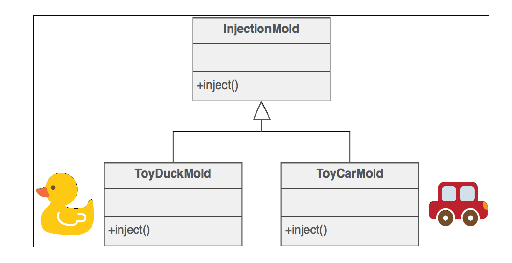
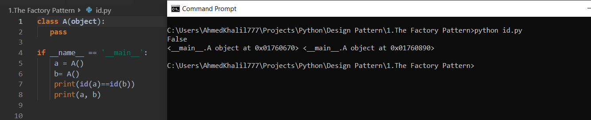

# In the Name Of ALLAH
---
## Intro to Creational Design Patterns 
 - Creational design patterns deal with an object creation .
 - The aim of a creational design pattern is to provide better alternatives for situations where a direct object creation (which    in Python happens by the __init__() function ) is not convenient.
---
## Intro Factory Design pattern 
 - In the Factory design pattern, a client asks for an object without knowing where the object is coming from (that is, which class is used to generate it).
 -  The idea behind a factory is to simplify an object creation. 
 - It is easier to track which objects are created if this is done through a central function, in contrast to letting a client create objects using a direct class instantiation [Eckel08, page 187].
 -  A factory reduces the complexity of maintaining an application by decoupling the code that creates an object from the code that uses it [Zlobin13, page 30].
---
## Components 
- Factories typically come in two forms: 
> __the Factory Method__, which is a method (or in Pythonic terms, a function) that returns a different object per input parameter [j.mp/factorympat];
> the __Abstract Factory__, which is a group of Factory Methods used to create a family of related products [GOF95, page 100], [j.mp/absfpat].
---
## The Factory Method
 - In the Factory Method, we execute a single function, passing a parameter that provides information about what we want.
 - We are not required to know any details about how the object is implemented and where it is coming from.
---
## A real-life example
- An example of the Factory Method pattern used in reality is in plastic toy
construction. 
- The molding powder used to construct plastic toys is the same,
but different figures can be produced using different plastic molds.
- This is like having a Factory Method in which the input is the name of the figure that we
want (duck and car) and the output is the plastic figure that we requested.
- The toy construction case is shown in the following figure, which is provided by
www.sourcemaking.com [j.mp/factorympat].
- 
---
## A software example
- The Django framework uses the Factory Method pattern for creating the fields
of a form.
-  The forms module of Django supports the creation of different kinds
of fields (CharField, EmailField) and customizations (max_length, required)
[j.mp/djangofacm].
---
## Use cases
- If you realize that you cannot track the objects created by your application because
the code that creates them is in many different places instead of a single function/
method, you should consider using the Factory Method pattern [Eckel08, page 187].

- The Factory Method centralizes an object creation and tracking your objects becomes
much easier. 
 > Note that it is absolutely fine to create more than one Factory Method,
and this is how it is typically done in practice. 
- Each Factory Method logically groups the creation of objects that have similarities. 
- For example, one Factory Method might be responsible for connecting you to different databases (MySQL, SQLite), another
Factory Method might be responsible for creating the geometrical object that you request (circle, triangle), and so on.

- The Factory Method is also useful when you want to decouple an object creation
from an object usage.
-  We are not coupled/bound to a specific class when creating an
object, we just provide partial information about what we want by calling a function.
- This means that introducing changes to the function is easy without requiring any
changes to the code that uses it [Zlobin13, page 30].

- Another use case worth mentioning is related to improving the performance and
memory usage of an application.
-  A Factory Method can improve the performance
and memory usage by creating new objects only if it is absolutely necessary
[Zlobin13, page 28]. 
- When we create objects using a direct class instantiation, extra
memory is allocated every time a new object is created (unless the class uses caching
internally, which is usually not the case).
- We can see that in practice in the following
code __(file id.py)__, it creates two instances of the same class A and uses the id()
function to compare their memory addresses. 
- The addresses are also printed in the
output so that we can inspect them. 
- The fact that the memory addresses are different
means that two distinct objects are created as follows:
  - ```
    class A(object):
      pass
    if __name__ == '__main__':
      a = A()
      b = A()
      print(id(a) == id(b))
      print(a, b)
    ```
 - and the execution of it :
  
 -Note that the addresses that you see if you execute the file are not the same as I see
because they depend on the current memory layout and allocation.
 -  But the result must be the same: the two addresses should be different. 
 - There's one exception that happens if you write and execute the code in the Python Read-Eval-Print Loop
(REPL) (interactive prompt), but that's a REPL-specific optimization which is not
happening normally.
---