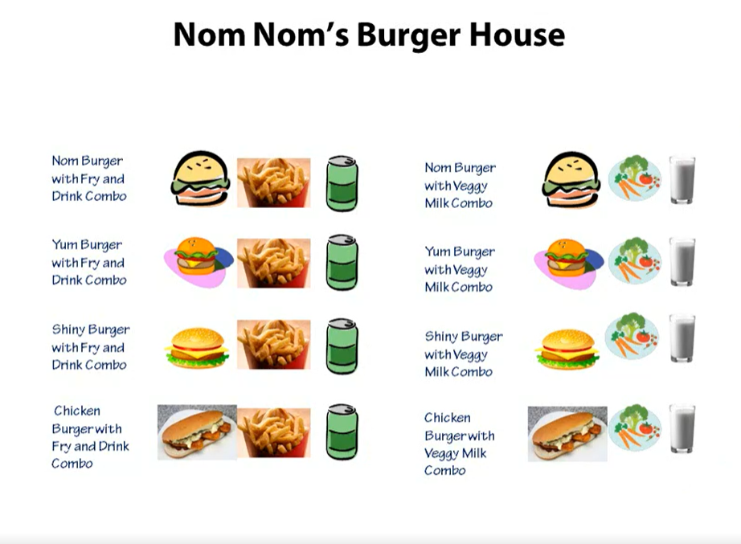
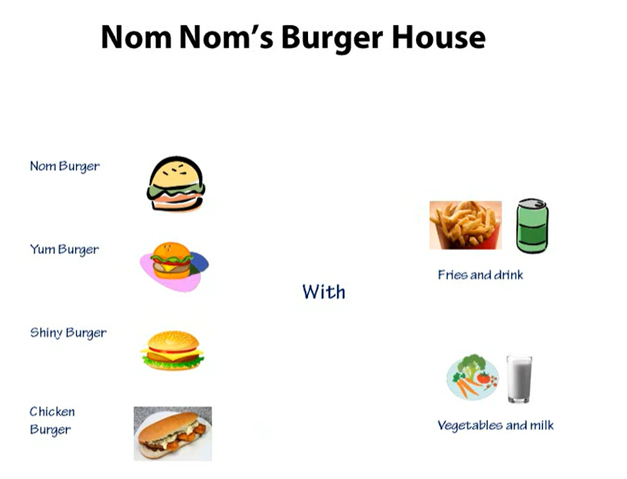
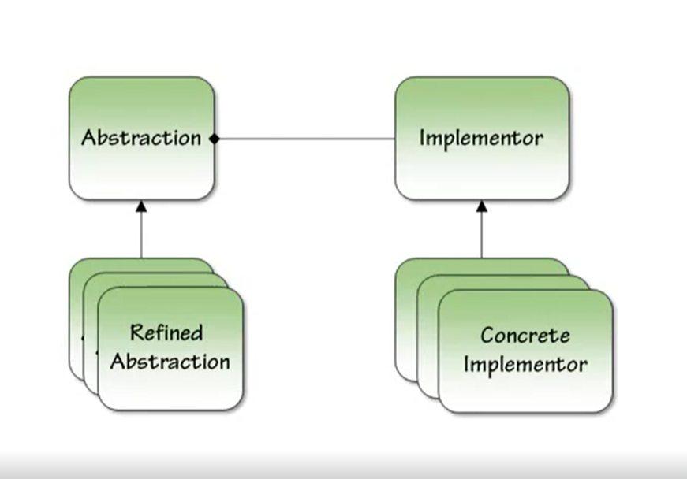

# In the Name of ALLAH
# Bridge Pattern
---
> Decouple an abstraction from its implementation, so the 2 can vary independently.

- Abstraction :- Abstraction :- Implementation
- IRepository :- IDomainRepository :- DomainRepository

- We don't need to couple the compos with each sandwitch

## Common Usages

- User Interfaces 
  - Shape
  - Drawing API

- Persistence
  - Object to persist 
  - persistence type

- .Net Provider model