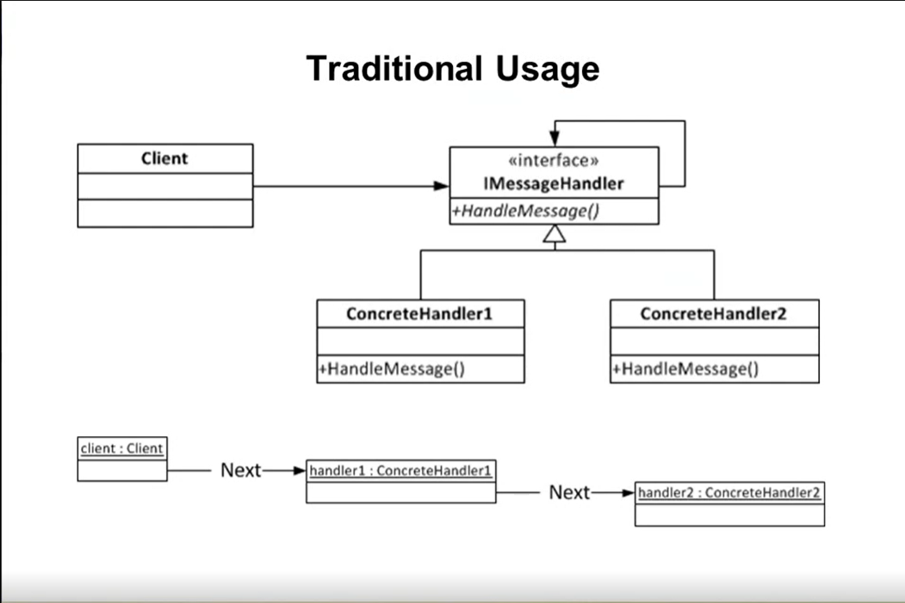

#  Chain Of Responsibility pattern

> Decouples the sender from the reciever, In a nutshell, order of message handlers, passing the message in order to the handlers.

- Example : A sender will send a message to Reciever1 then Reciever1 will send to Reciever2 to be handled theare and reaturn the response to the sender.The sender didn't know where it handled and The Receiver3 didn't process . 

- Sender is aware only for one reciever.
- Each reciver is only aware for the next reciver.
- Recievers process the message and send it down the chain.
- The first reciever to handler the message terminates the chain.
- The Order of reciever list matters.

.

## Motivating Example

- William need to send the expense to his manager to approve it.
- His manager has no authority to approve it, so the manager sent the expense to Vice President the President has the complete authority to approve so he approved it and send it back to william.
