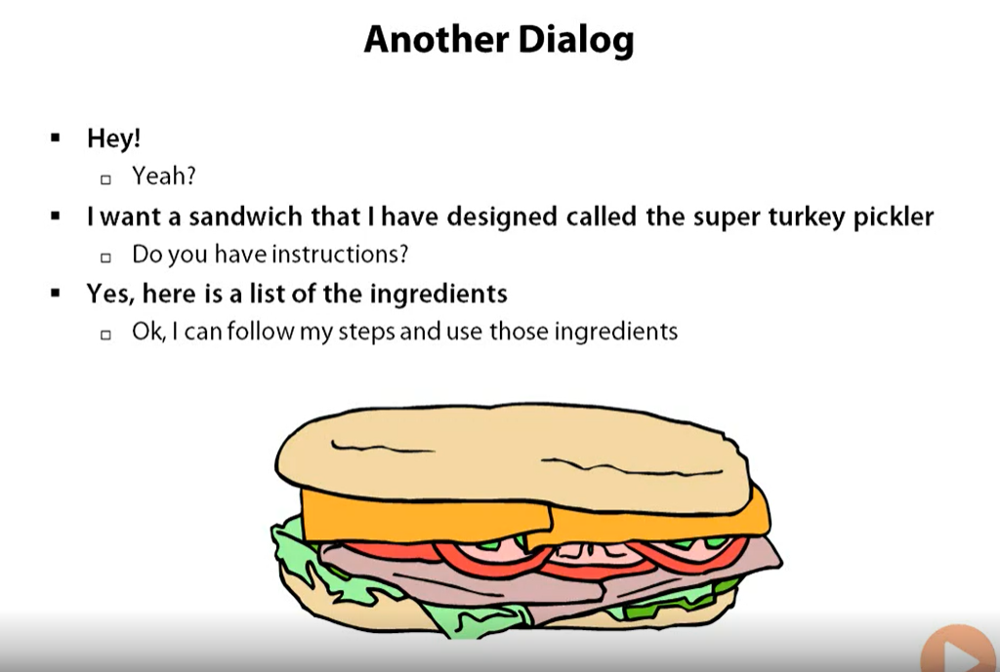

# In the Name of ALLAH
# Builder Pattern
---------

> Problem Statement:
- How to handle many parameter in constructor and deffer this to a builder that can build those parameters into your object.
- In .Net we are using the Host to host the app, but the host is really big object have a great capabilities and can not be handled ony by paramaterization so the Builder must come to solve this problem.
- Builder Handling ( To Many Params, Ordering of params , Different Constructors)
- Builder Variations 

> Separate the construction of a complex object from its represntation so that the same construction process can create different repreentations.

