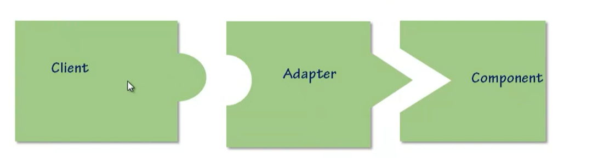
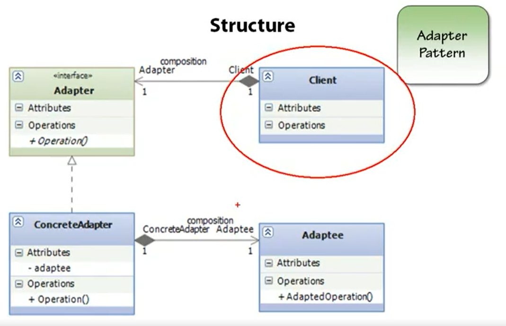

# In the Name of ALLAH
# Adapter Pattern
---

> The Adapter pattern is a structural design pattern that allows objects with __incompatible interfaces__ to work together by creating a _middleman_ called an adapter. The adapter acts as a _translator_ or a _bridge_ between the two incompatible interfaces, enabling them to interact seamlessly.

- In simple terms, think of an adapter as an electrical plug converter. When you travel to a different country with different electrical outlets, you need an adapter to convert the plug on your device to fit the local outlet.

- In software development, the Adapter pattern is used when you have two classes or components that cannot directly communicate due to incompatible interfaces. The adapter wraps one of the classes and provides a compatible interface that the other class can understand. This allows the two classes to collaborate without requiring any changes to their existing code.

> Problem Statement :
- A class that would be useful to your application does not implement the interface you require
- You are designing a class or a framework and you want to ensure it is usable by a wide variety of as-yet-unwritten classes and applications.

- Adapters are also known as wrappers

- To Convert the interface of a class into another interface clients expect.

- Effective way to implement the Open/ Close Principle